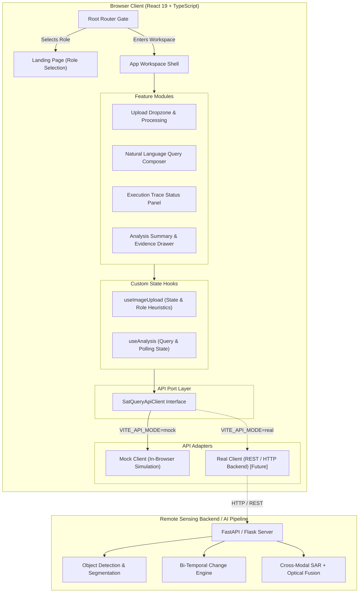
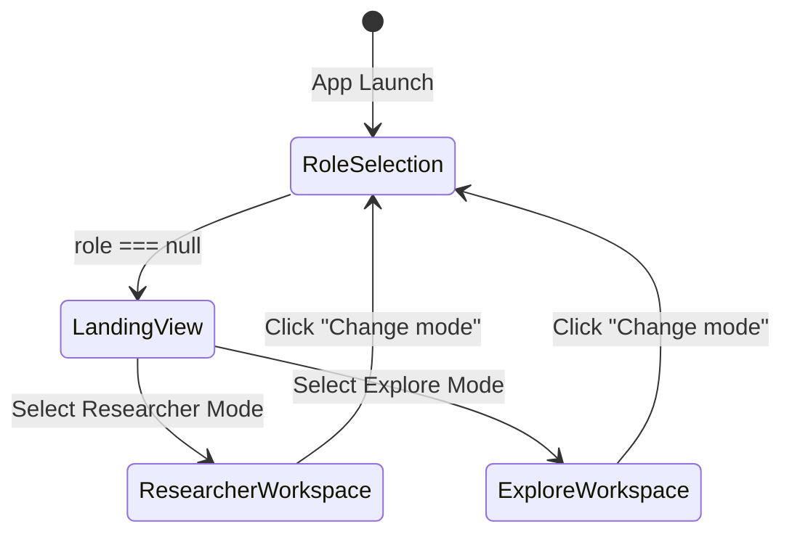
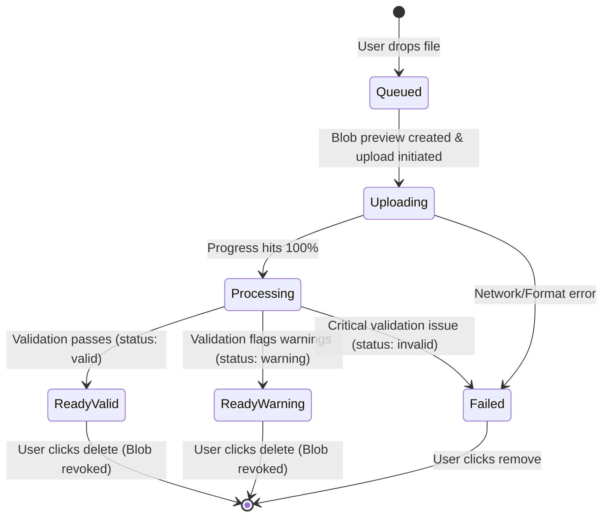
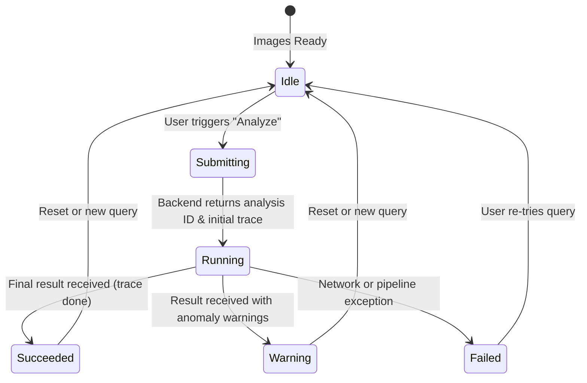
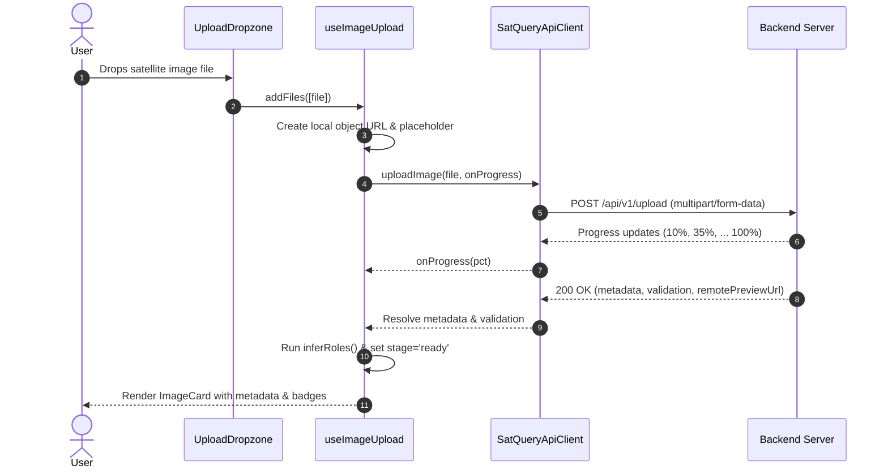
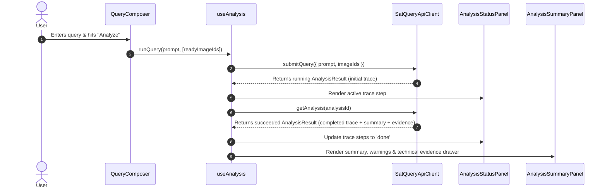

# GeoLens Frontend — System Architecture

> **Project**: GeoLens (`satquery-ai`)  
> **Initiative**: Smart India Hackathon 2026 — Problem Statement **SIH26167**  
> **Architecture Pattern**: Hexagonal (Ports & Adapters) + Component-Driven Unidirectional Flow  
> **Target Environment**: Web Client (React 19, TypeScript, Vite, Tailwind CSS v4)

---

## 1. Architectural Philosophy

GeoLens is an **evidence-first, agentic interface** designed for multimodal remote-sensing image analysis. Unlike conventional black-box conversational systems, GeoLens prioritizes technical auditability, trace visibility, and grounded verification.

### Core Tenets
1. **Evidence-First Verification**: Every analytical claim presented to the user is backed by an inspectable execution trace and discrete evidence metrics (bounding regions, pixel classifications, spectral indices).
2. **Ports & Adapters (Hexagonal) API Separation**: The UI and feature logic are completely decoupled from the transport and backend implementations. All network operations communicate exclusively through the `SatQueryApiClient` interface.
3. **Modal-Agnostic Ingestion**: Supports single scenes, temporal pairs (before/after), and cross-sensor pairs (Optical + Synthetic Aperture Radar - SAR) through heuristic role inference.
4. **Resilient Offline / Demo Capability**: The architecture features a self-contained in-memory mock engine that runs fully offline without requiring an active AI backend.

---

## 2. High-Level System Topology



---

## 3. Layered Application Architecture

GeoLens adopts a four-tier architecture:

```
┌─────────────────────────────────────────────────────────────┐
│                    Presentation Layer                       │
│    Landing Page · Header · ImageCard · QueryComposer        │
│   AnalysisStatusPanel · AnalysisSummaryPanel · Badges       │
├─────────────────────────────────────────────────────────────┤
│                    Application State Layer                  │
│       useImageUpload (Queue, Blob URLs, Role Inference)     │
│       useAnalysis (Execution Trace, Result, Polling)        │
├─────────────────────────────────────────────────────────────┤
│                      Domain & Types                         │
│           ImageMetadata · Validation · ExecutionTrace       │
│           EvidenceItem · AnalysisQuery · Modality           │
├─────────────────────────────────────────────────────────────┤
│                  Infrastructure (API) Layer                 │
│        SatQueryApiClient Interface · MockClient · Env       │
└─────────────────────────────────────────────────────────────┘
```

### 1. Presentation Layer (`src/components/`, `src/features/`, `src/pages/`)
- **Presentational / Dumb Components**: Reusable, pure UI components (`Panel`, `StatusBadge`, `EmptyState`, `ErrorPanel`, `WarningPanel`, `icons`). They receive data and event handlers via standard props.
- **Feature Composites**: Stateful composites (`UploadDropzone`, `QueryComposer`, `AnalysisSummaryPanel`) that coordinate UI interaction patterns.

### 2. Application State Layer (`src/hooks/`)
- Encapsulates stateful workflows, async lifecycle transitions, and memory management.
- Pure React hooks (`useImageUpload`, `useAnalysis`) with zero coupling to DOM or backend mechanics.

### 3. Domain & Types Layer (`src/types/`, `src/utils/`)
- Strongly typed TypeScript contracts modeling remote-sensing data structures.
- Formatters and converters ensuring consistent tabular representations.

### 4. Infrastructure Layer (`src/api/`)
- Pure client interface abstractions allowing zero-touch switching between mock simulation and production backend environments.

---

## 4. State Machines & Lifecycles

### 4.1 Root Navigation & Role State Machine
Manages user onboarding and mode switching.



### 4.2 Image Upload & Validation State Machine
Each image added to the workspace operates as an independent state machine.



### 4.3 Query Analysis Lifecycle
Manages user query execution and trace updates.



---

## 5. Domain Logic & Algorithms

### 5.1 Heuristic Modality & Multi-Sensor Pair Detection
Remote sensing imagery can represent various sensors and acquisition windows. GeoLens automatically identifies the semantic relationship among uploaded scenes without requiring manual user tagging.

```mermaid
flowchart TD
    Start[Uploaded Scenes in 'Ready' Stage] --> CountCheck{Count < 2?}
    CountCheck -- Yes --> Single[Role: 'single']
    CountCheck -- No --> CheckSensors{Has SAR + (Optical or MS)?}
    CheckSensors -- Yes --> AssignCrossModal[Assign 'sar-pair' to SAR, 'optical-pair' to Optical/MS]
    CheckSensors -- No --> AssignTemporal[Assign Temporal Roles by Upload Chronology: First = 'temporal-before', Subsequent = 'temporal-after']
```

#### Modality Detection Rules:
- Filename contains `sar` $\to$ `ImageModality: 'sar'` (Bands: 1)
- Filename contains `ms` or `multispectral` $\to$ `ImageModality: 'multispectral'` (Bands: 8)
- File extension `.tif` or `.tiff` $\to$ `ImageModality: 'optical'` (Bands: 3)
- Default $\to$ `ImageModality: 'unknown'`

### 5.2 Memory-Safe Object URL Lifecycle Management
To render high-resolution raster imagery instantly in the browser without waiting for cloud round-trips:
1. `URL.createObjectURL(file)` is invoked upon drop.
2. The generated URL is registered into a persistent `useRef<Set<string>>` pool.
3. When the user removes an image, `removeImage(id)` queries the pool and executes `URL.revokeObjectURL(url)`.
4. This prevents memory leaks from accumulating large satellite raster files in browser heap memory.

---

## 6. End-to-End Sequence Workflows

### 6.1 Upload & Metadata Ingestion Flow



### 6.2 Query Submission & Execution Trace Flow



---

## 7. Connecting a Real Backend (Integration Guide)

Connecting GeoLens to a production backend (e.g. FastAPI, Python Flask, or Node.js) requires implementing the `SatQueryApiClient` interface in a new adapter file:

### Step 1: Create `src/api/real/realClient.ts`

```typescript
import type { SatQueryApiClient } from '../client'
import type { ImageMetadata, ImageValidation } from '@/types/image'
import type { AnalysisResult } from '@/types/analysis'

const BASE_URL = import.meta.env.VITE_API_BASE_URL ?? 'http://localhost:8000'

export const realClient: SatQueryApiClient = {
  async uploadImage(file, onProgress) {
    const formData = new FormData()
    formData.append('file', file)

    const xhr = new XMLHttpRequest()
    return new Promise((resolve, reject) => {
      xhr.upload.onprogress = (e) => {
        if (e.lengthComputable && onProgress) {
          onProgress(Math.round((e.loaded / e.total) * 100))
        }
      }
      xhr.onload = () => {
        if (xhr.status >= 200 && xhr.status < 300) {
          resolve(JSON.parse(xhr.responseText))
        } else {
          reject(new Error(xhr.statusText))
        }
      }
      xhr.onerror = () => reject(new Error('Network error during image upload'))
      xhr.open('POST', `${BASE_URL}/api/v1/images/upload`)
      xhr.send(formData)
    })
  },

  async submitQuery(query) {
    const res = await fetch(`${BASE_URL}/api/v1/analysis/query`, {
      method: 'POST',
      headers: { 'Content-Type': 'application/json' },
      body: JSON.stringify(query),
    })
    if (!res.ok) throw new Error('Query submission failed')
    return res.json()
  },

  async getAnalysis(analysisId) {
    const res = await fetch(`${BASE_URL}/api/v1/analysis/${analysisId}`)
    if (!res.ok) throw new Error('Failed to fetch analysis status')
    return res.json()
  },

  async checkBackendStatus() {
    try {
      const res = await fetch(`${BASE_URL}/health`, { method: 'GET' })
      return { online: res.ok, mode: 'real' }
    } catch {
      return { online: false, mode: 'real' }
    }
  }
}
```

### Step 2: Update `src/api/index.ts`
Switch `createClient()` to return `realClient` when `mode === 'real'`.

### Step 3: Configure `.env`
```env
VITE_API_BASE_URL=http://localhost:8000
VITE_API_MODE=real
```

---

## 8. Extensibility Roadmap (Parts 2 to 4)

The project directory structure already reserves designated folders for subsequent implementation phases:

| Phase | Feature Focus | Target Module | Technical Scope |
|---|---|---|---|
| **Part 1** | Foundation & Core UI | `upload/`, `analysis/`, `pages/` | Workspace shell, upload dropzone, role heuristics, mock pipeline, landing page |
| **Part 2** | Geospatial Grounding & Map View | `features/grounding/` | Leaflet (`react-leaflet`) map integration, GeoJSON layer overlay, bounding-box visualizers |
| **Part 3** | Change Detection & Cross-Modal Fusion | `features/change-detection/`, `features/cross-modal/` | Dual-view split comparison slider, difference heatmaps, optical vs SAR registration views |
| **Part 4** | Advanced Reporting & Production Real Client | `src/api/real/`, `features/demo/` | Automated PDF/GeoTIFF report exporter, real model API connection, telemetry and benchmarking |
